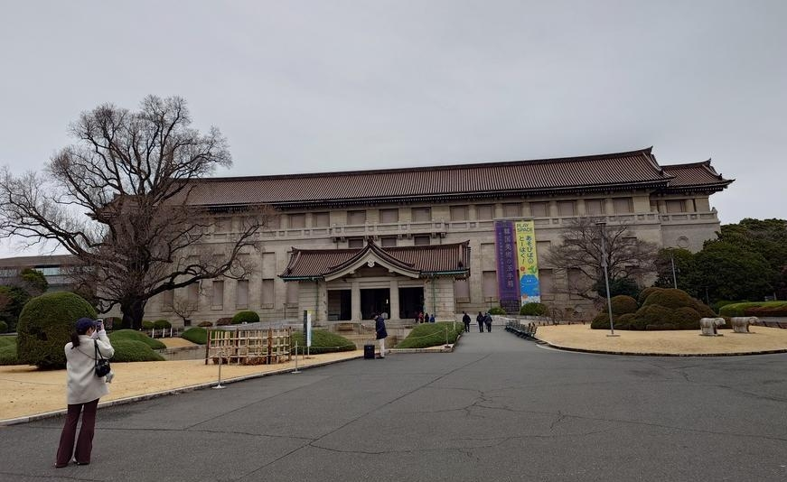
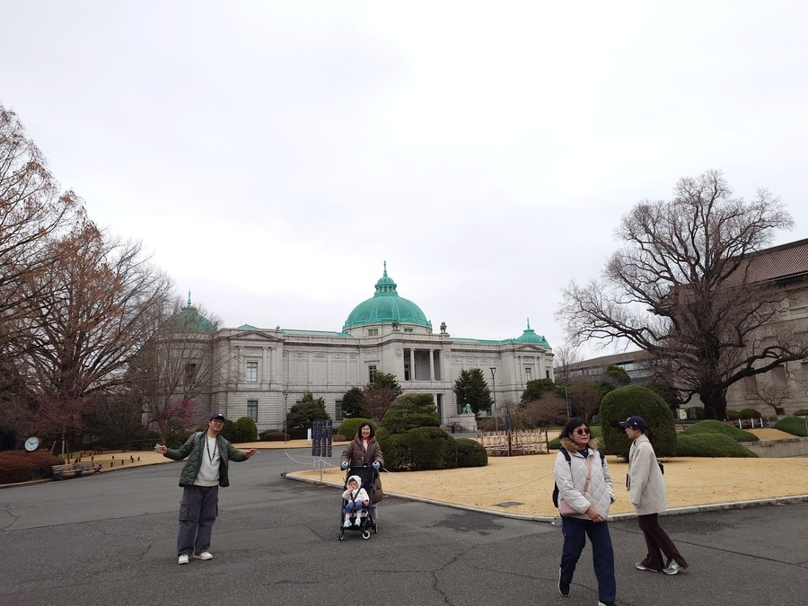
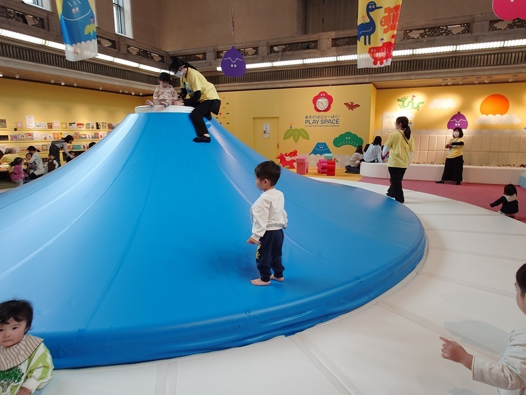
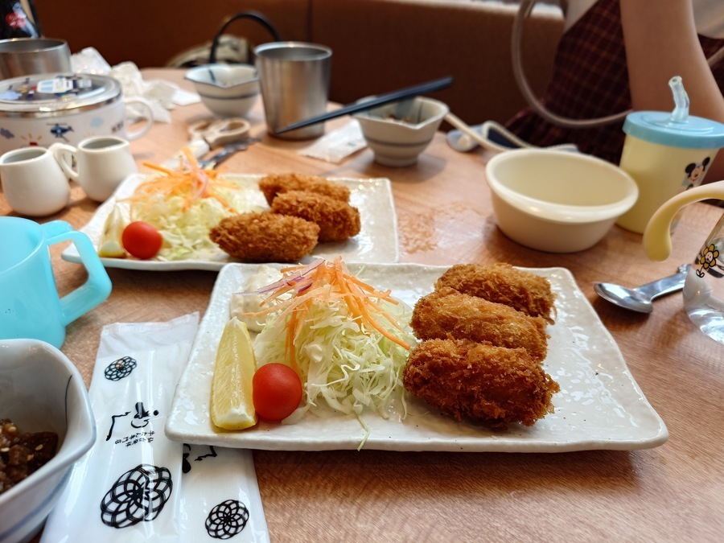
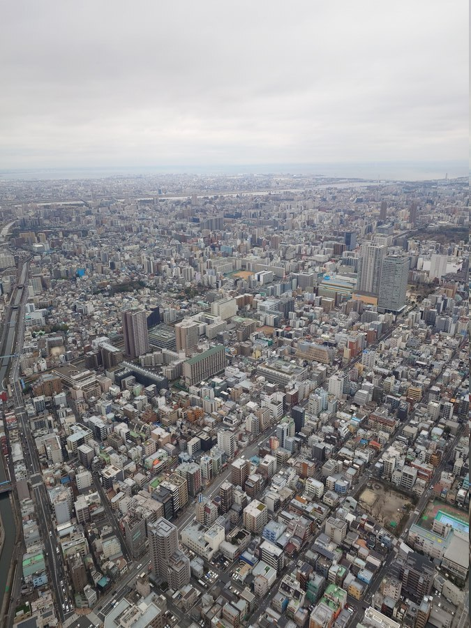

去年九月才到東京，今年二月又和家人一起出遊到東京！

和上次不同的是這次陣容浩大，整個家族約十五人的團體，行動上雖然沒有和老婆單獨出去靈活，但大家一起離開台灣出門到不同的地方，也增添了許多趣味。

### 東京國立博物館

位於上野的東京博物館，館內就像一個大公園，門票很便宜只需要 **2,500日圓**，裡面展出的內容很豐富，不定時會一直換展覽內容。

博物館外的風景也很美，充滿歐式建築與修整完善的樹木。

### 館內兒童遊樂區

當時有一個特區，專屬於小朋友玩耍的遊樂區，還有一個可以爬的富士山，也有許多給小朋友玩的日文童書（雖然根本看不懂）還有日本童玩，感覺有許多東京當地的家庭主婦會帶小朋友來這邊玩。

我和老婆常常會帶小孩到台中的親子館玩耍，我們都有同樣的結論，好像日本媽媽比較少會在一旁滑手機，或許台灣人真的比較依賴在智慧型手機上吧？

### 利久牛舌炸牡蠣套餐

中午用餐我們到了晴空塔裡的餐廳─利久牛舌，但不按牌理出牌，我吃的是炸牡蠣套餐，相當酥脆很好吃，感覺好像比牛舌還更推薦～

### 晴空塔

後來到的東京著名的晴空塔，日本第一高塔，門票分兩種，一個是進入350公尺高的甲板，可以欣賞窗外的景色，再加價到450公尺高的還有一個迴廊可以欣賞坡道景色，為了帶小孩方便，我們只有到350公尺高的甲板區觀賞。

到了甲板上其實就是拍拍照，看看景色，因為是封閉的室內環境所以很安全，上面還有賣咖啡，幫人拍照的攝影師（須收費），本文的封面圖就是攝影師幫我們拍攝的照片，除了洗出實體照片外還提供電子檔，價格3000日圓～

晴空塔講真的好像沒有到很推薦，電梯搭上去的速度非常快，但除了看風景其實也不能做什麼事情，大約待個十五分鐘就會想下來了，而且下來比上去困難，要排隊排很久的…

晴空塔窗外的景色，看出去是滿是高樓的東京，還蠻壯觀的。

後面再和大家分享去離開上野後去長野滑雪的心得！
