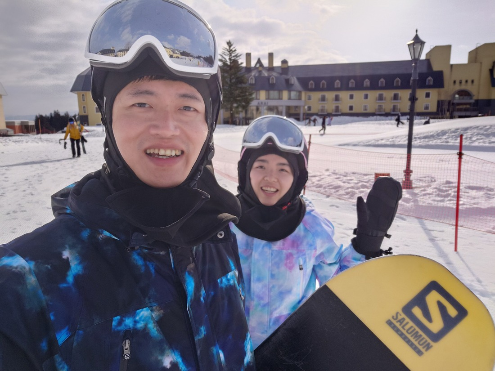
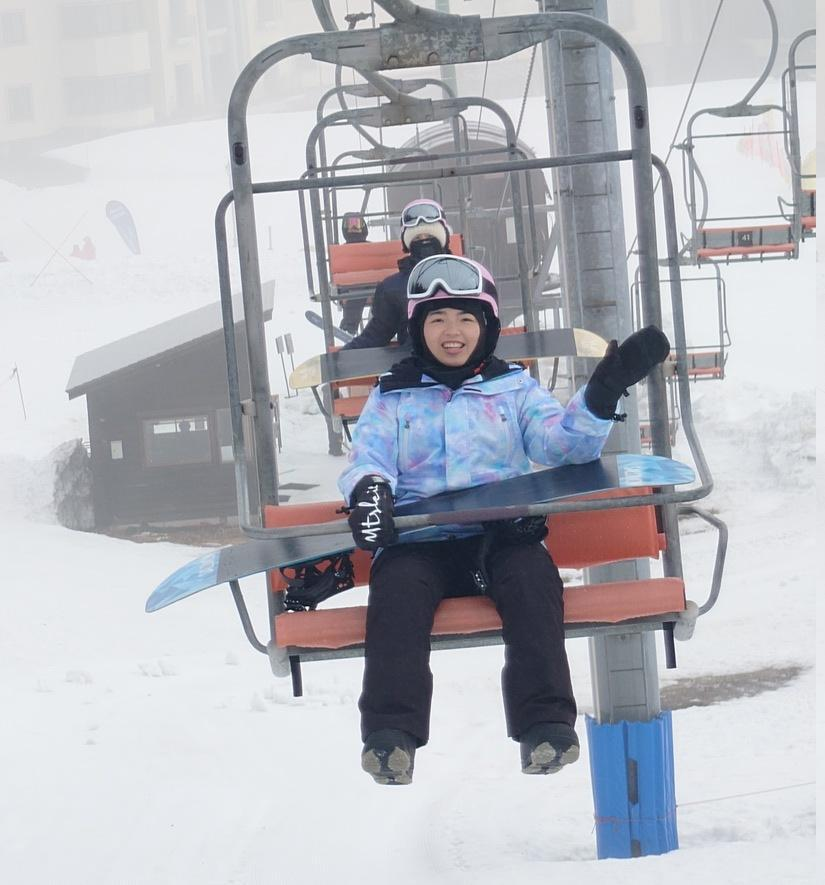
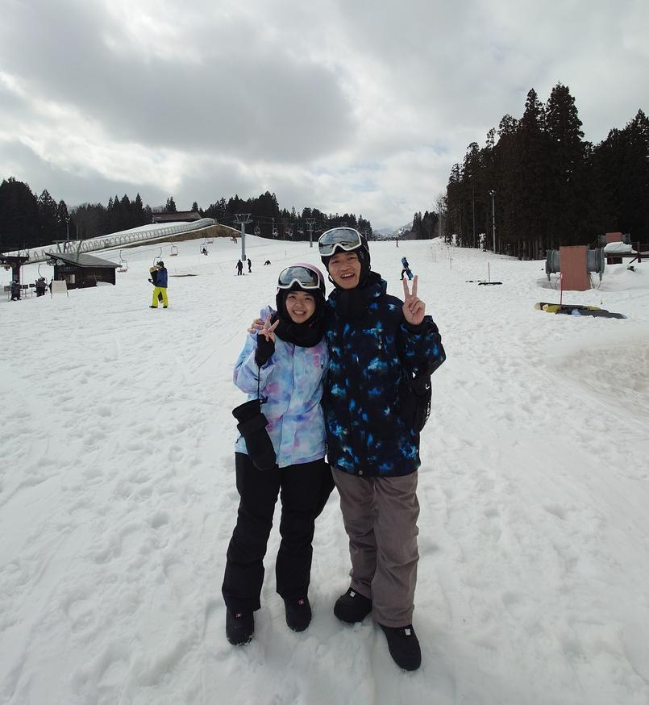
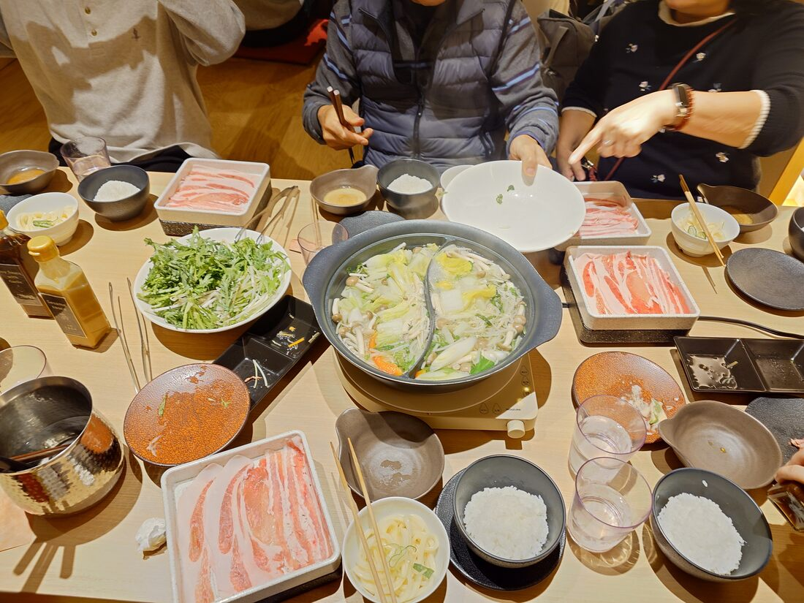

接續上一篇文，這次到日本的最大目的就是要去滑雪！

這次跟著姊夫公司的旅行團，和一家人同行加上姊夫公司即其他同事親友團共約一百人，陣容浩大的前往位於長野縣的[樂天新井渡假村](https://www.lottehotel.com/arai-resort/zh)。

這次入住樂天集團的飯店，等級很不錯，室內空間超級大，估計有十五坪以上，兒子一到房間已經壓抑不住興奮的心情，到處亂跑亂玩，整個很不受控制。

後來隔天一大早，就將兒子交給爸媽協助照顧，這裡真的很感謝有他們的幫忙，讓我們夫妻有機會可以放下小孩去自由滑雪。

我們兩個都是初學者，這次跟的旅行團不只包了雪票，還有帶一位教練上團體課，團課的老師都是台灣來的，而且大家都好年輕，真佩服他們可以二十出頭就擔任滑雪教練的工作。

滑雪必搭的纜車，體驗也很有趣，坐習慣以後還可以穿著滑雪板搭纜車一下車就直接滑出去，超酷！

滑完兩天的行程，練習了Heelside、Toeside以及落葉飄，有慢慢掌握到滑雪的樂趣，老婆也很厲害都有一起參與課程，練習得很認真！

滑完雪後和大家一起共進晚餐，樂天新井渡假村有大約三四種餐廳，有日式buffet、歐式buffet、牛排館、火鍋，其中只要是 buffet 都很好吃，火鍋的部份感覺沒有台灣的厲害了。

整體而言我覺得樂天渡假村的設施都還不錯，餐點也好吃，整個雪景的環境也很美麗，滑雪場由於我是新手所以不多做評論，但聽其他有滑過很多地方的朋友表示，這裡的雪算蠻不錯的！

下一篇和大家分享到長野近郊旅遊～

