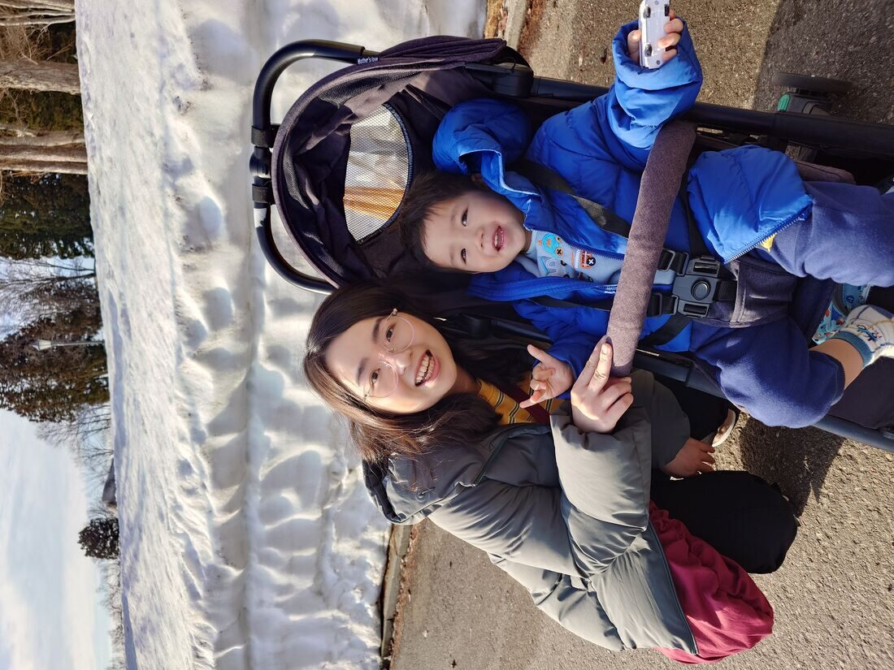
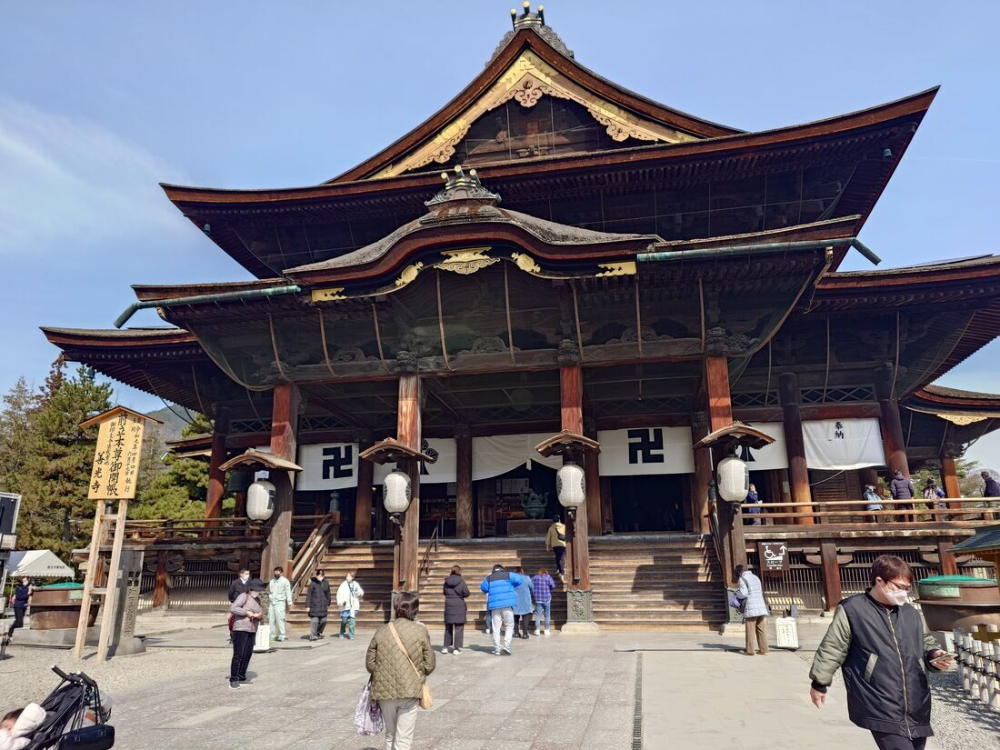
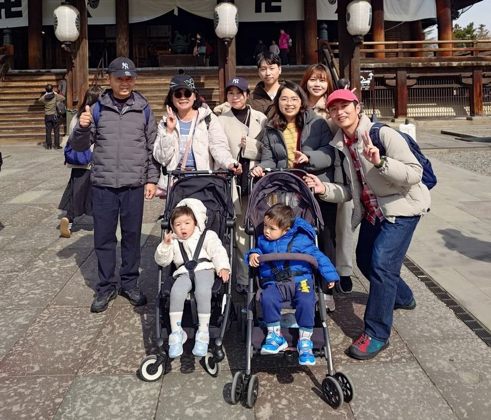
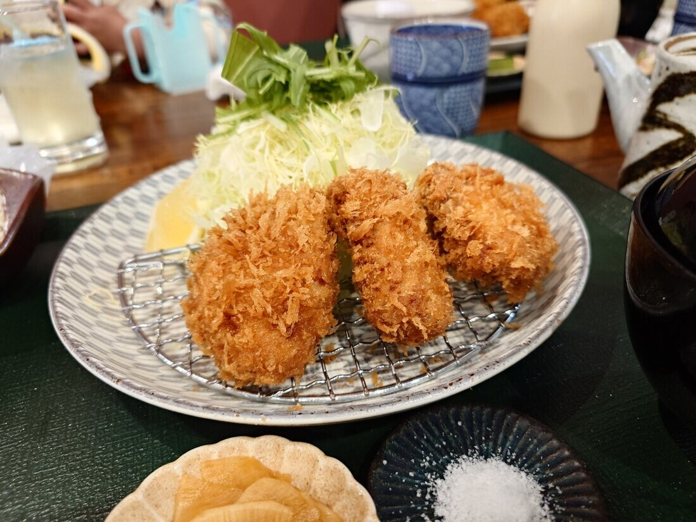
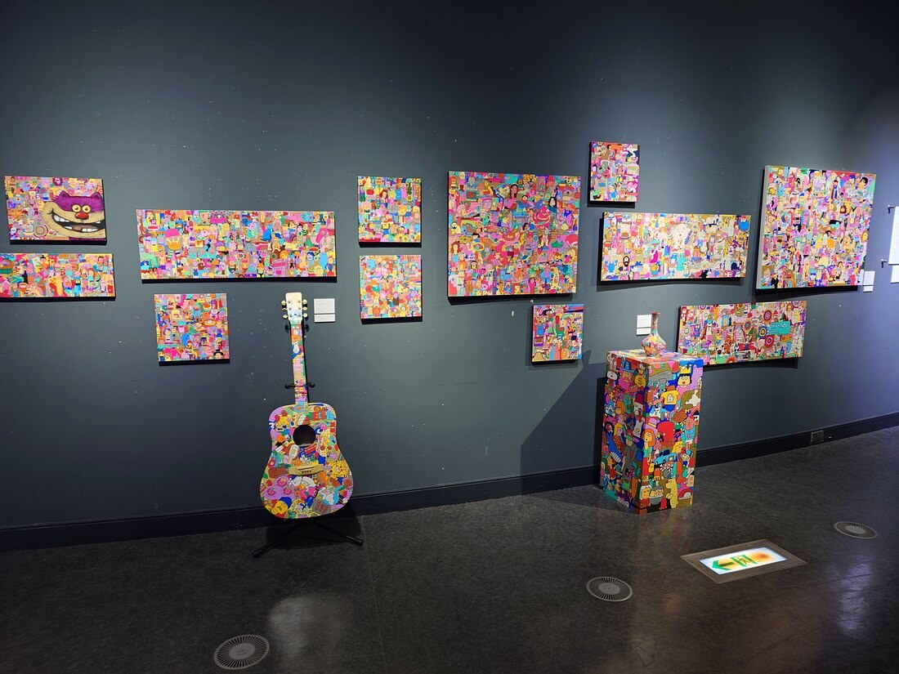
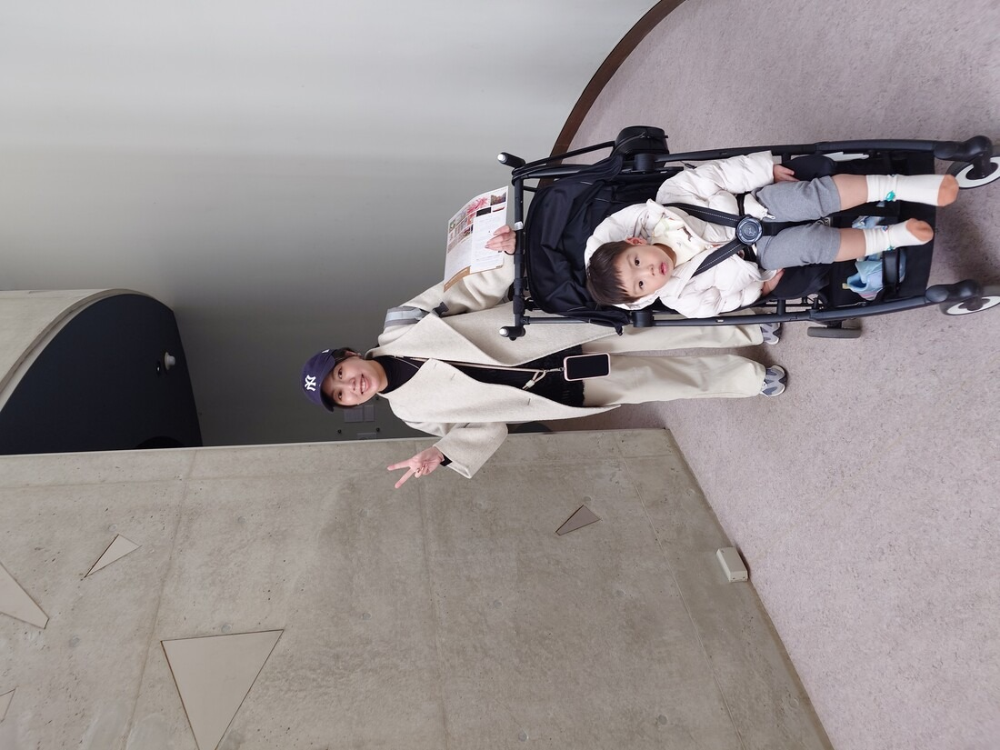
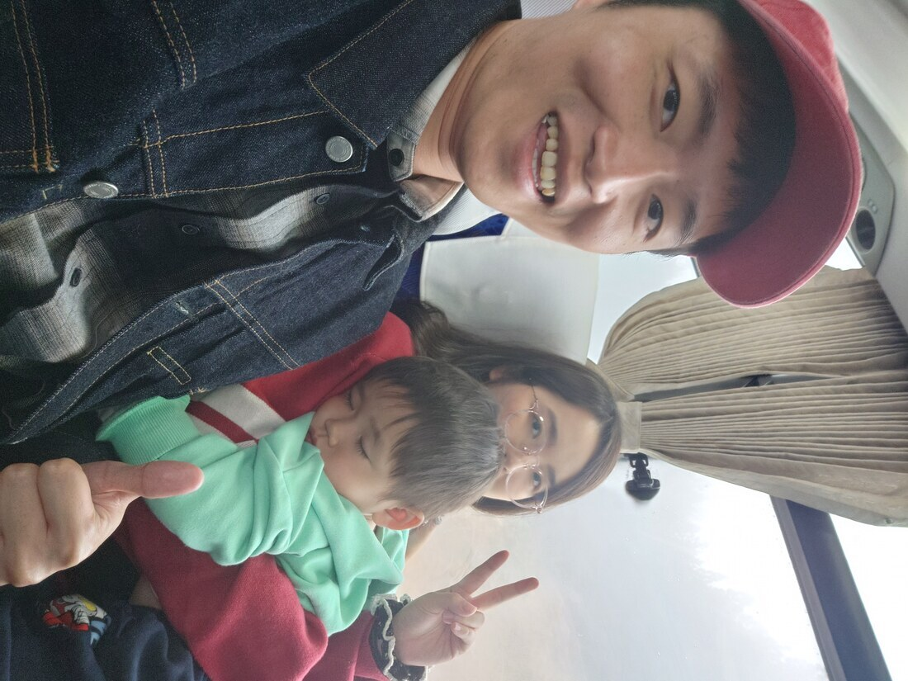

連續滑了兩天的雪，第三天和家人們一起到長野市旅行。

不同於以往到日本旅遊都是在最熱鬧的東京市區，長野相較之下步調悠閒許多，根據[維基百科](https://zh.wikipedia.org/wiki/%E9%95%B7%E9%87%8E%E5%B8%82)的資料，長野市為日本都道府縣中海拔最高的縣廳所在地，當地冬天積雪量較多，但我們去的時候已是三月初，所以天氣還蠻舒服的~

前幾天都是跟老婆一起到滑雪場玩，今天和兒子一起出門旅遊，他也超級興奮的。

搭乘遊覽車前往目的地，如同日本其他寺廟，善光寺當天遊客眾多，也因為當天是東京馬拉松剛結束，出現許多歐美觀光客。

一行人到處走走看看，進入寺廟內因為無法攝影就沒有留照片了，大家就一起在寺廟門口合影留念。

中午選擇在姐姐找的[とんかつ専門店 からり](https://maps.app.goo.gl/F7RsvoSiLMReWyep6)用餐，

這間的豬排很軟嫩，套餐價錢約2000日幣，沒多做功課就進去用餐，但想不到還不錯，推薦給大家。

參觀完善光寺後，下一個行程是「地獄谷 野猿の露天風呂」，在網路上很有名，但路途需要走一些崎嶇的道路，對帶小孩的我們不太方便，我們一家三口加上我姊跟他小孩選擇在附近的美術館—[山之內町立志賀高原羅馬美術館](http://www.s-roman.sakura.ne.jp/index.htm)參觀，這是一個鄉下的小美術館，裡面展覽品很少，算是找到一個可以休息的地方吧！

姐姐跟他兒子和我兒子也一起玩得很開心就好，附上她帶兒子的合照~

最後大家都參觀完以後還到了長野當地的AEON百貨採買，是一個超大的商場，大概像大型家樂福那種感覺，採買完畢後就返回樂天渡假村了~

回去的路上大家都累了，兒子也終於肯在遊覽車上睡覺啦，帶小孩出去大家都不容易，肯睡覺就是最大的救贖了😄

這次的日本之旅就記錄到這邊~期待與大家下一次旅行😊
