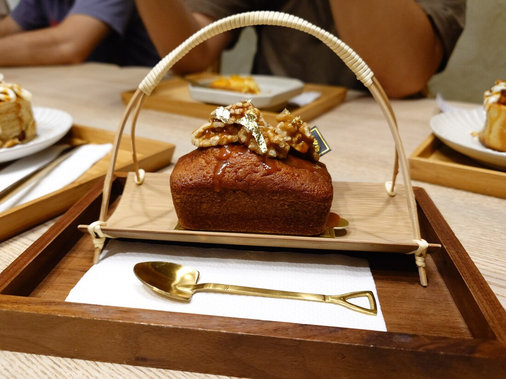
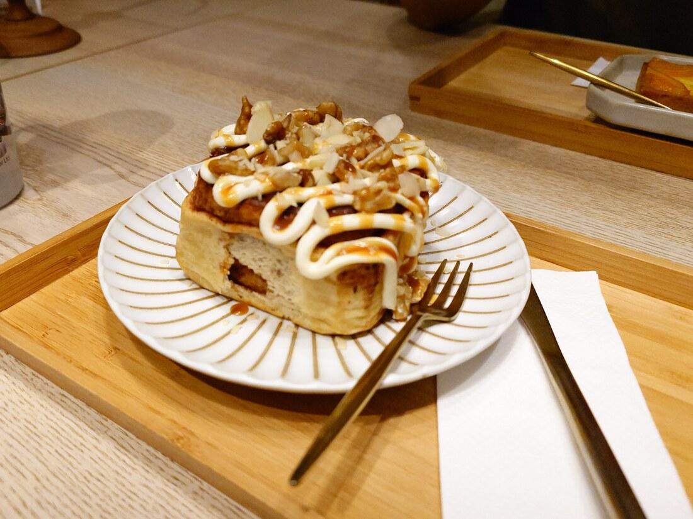
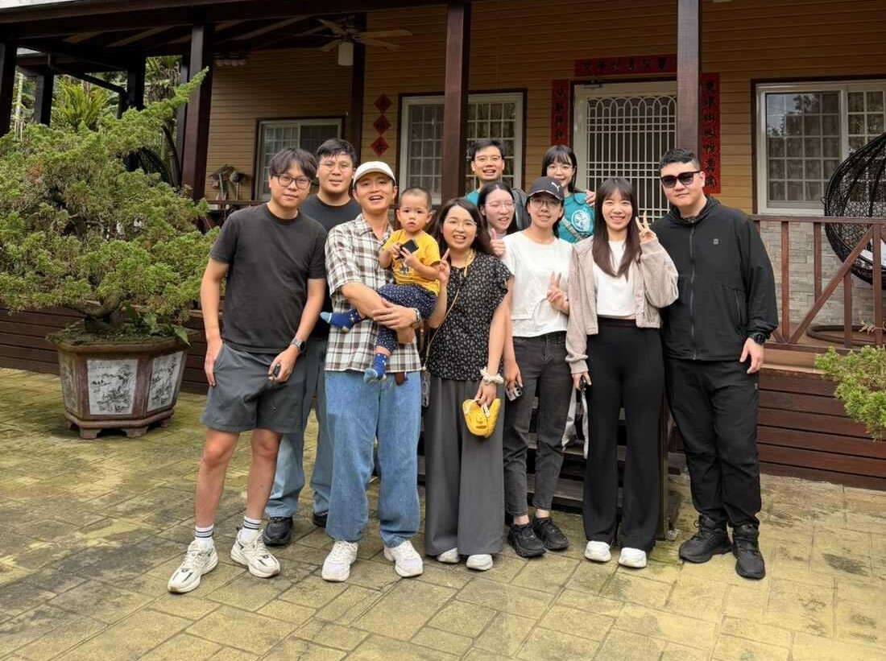
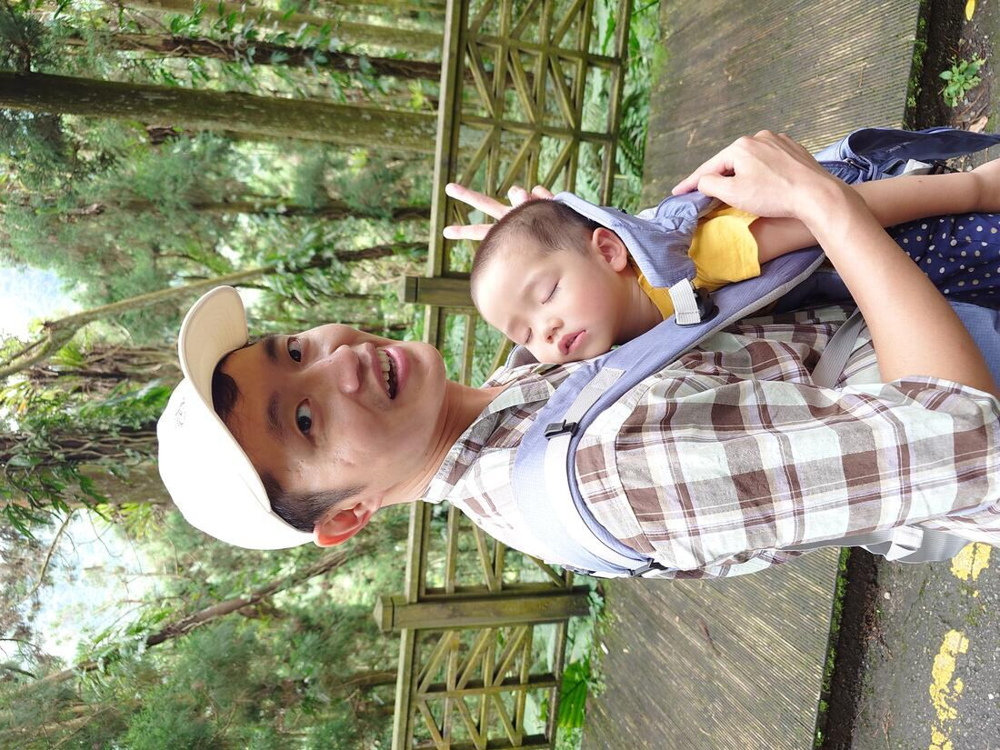
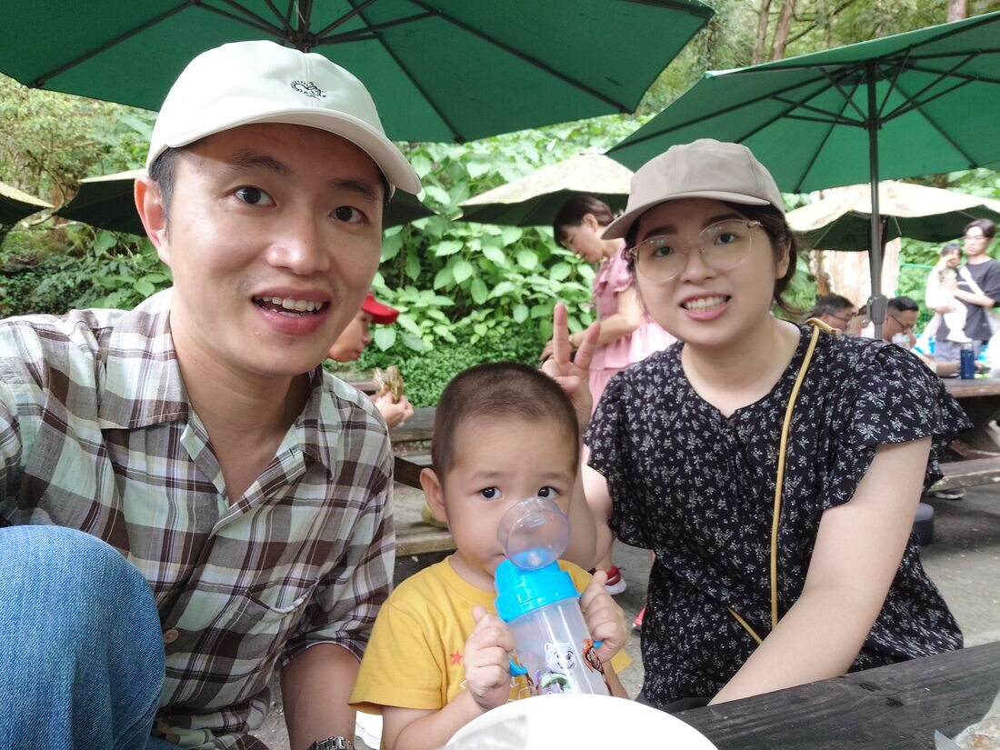
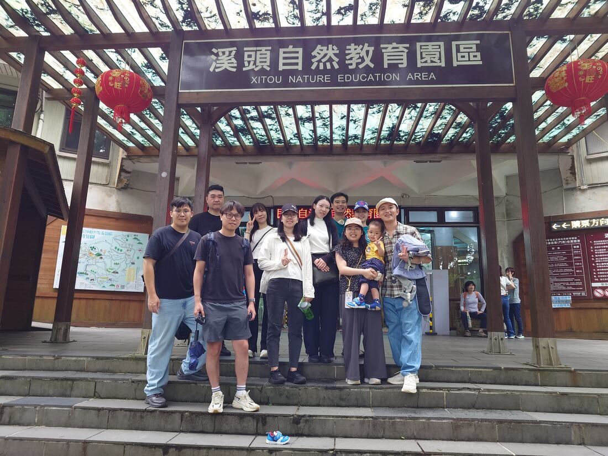

在今年六月時與好朋友一起到南投郊遊，和之前[泊樂熊村](https://fgzblog.com/zh-tw/posts/camping_in_nantu/)同一團好友，距上一次一起出遊也有兩年多的時間了，想當時兒子還在老婆肚子裡，現在已經是蹦蹦跳跳的兩歲小孩了。成員也有不同，這次有人新增了一點親友加入，感覺更熱鬧了✌️

原定是第一天要去溪頭遊覽，後面再到其他景點逛逛，但剛好出遊前遇上強烈西南氣流來襲，全台各地都在下大雨，當時還想可能這次出遊需要延後舉行了。

但好在當天早上天氣還可以，陰陰涼涼的，有下一點小雨，整體而言反而可以少去酷暑的炎熱感。

### 水里蛇窯

第一站我們到水里蛇窯，這裡是一個陶藝展覽及體驗捏陶的地方，全票門票是160元，可以折抵裡面的餐飲消費，但體驗捏陶製作需額外費用，進去能參觀的展覽也很不多，個人覺得門票算CP值普普，朋友們都有去體驗製作捏陶做一個碗，我帶著兒子到處晃晃玩玩，參觀捏陶用具及歷史解說，有一個地方在播放水里蛇窯的來源的影片，幾乎整部片都是AI生成的，少了現場解說員的介紹，可能這就是時代趨勢吧。

製作完陶土，到陶藝商店逛逛，再吃個中餐，之後再去裡面的咖啡廳休息，甜點倒是不錯吃喔，我和老婆點了磅蛋糕和肉桂捲🥰

### 蓁艾家圓民宿

我們這次住的民宿是[蓁艾家圓](https://love.616stay.tw/)整棟都是小木屋，房間數很多，我們整團十個大人加一個小孩住起來還很寬敞，重點是老闆還有KTV可以歡唱，對於我們這群愛唱歌的人是超重要！

這間民宿位置離溪頭不遠，距離約七公里，方便一早出發去爬山或是爬完山要回民宿休息都很方便，民宿老闆人也不錯，沒有與客人住在同一間房子，讓人感覺比較自由~

之後出發到民宿，事前採買了一點烤肉用品，和[香串串烤肉食材用品店](https://www.bbq.com.tw/)事前預訂購買，剛好在鹿谷有一間門市可以取貨，對於要到外面烤肉的人準備起來是很方便，但分量不多，建議多買一點，我們不夠吃，民宿老闆還開車出去幫我們再補買一點東西，真是幫了大忙。

隔天早上吃完民宿老闆的早餐（素蛋餅），收拾完行李，一行人就出發到溪頭爬山啦，真是好幾沒有這麼健康的行程了😂。

### 溪頭國家森林遊樂園

開車約十幾分鐘就到溪頭園區了，付完入場券門票後，就開始一路走，幾年前來過一次，當初自己獨自行走覺得這裡實在輕鬆到不行，老少咸宜的路線，這次揹著兒子一起上山，他也有12公斤了，揹著娃娃進行爬坡運動，感覺真不輕鬆阿，好在兒子很配合，不會一直哭鬧，甚至還可以讓我揹到睡著，真是感覺他一點一點在長大。

之後我們一路走過大學池後，兒子就一路開始睡覺，再走到神木區後，他就起床了，真是快樂又舒服爬山的小弟。

在神木區大家一起用餐休息，到山頂還有一個販賣部可供遊客休息吃飯，這裡的販賣部東西品項真不少，茶葉單、炒麵、肉粽、飲料及冰淇淋應有盡有，飽餐一段後就下山啦！

平時假日去哪天氣都好熱，幾乎都是去逛百貨公司或看博物館之類的行程，但這次溪頭旅行，大家一起遠離都市喧囂，到涼快的山裡行走，感覺真不錯，期待下一次的出遊。

