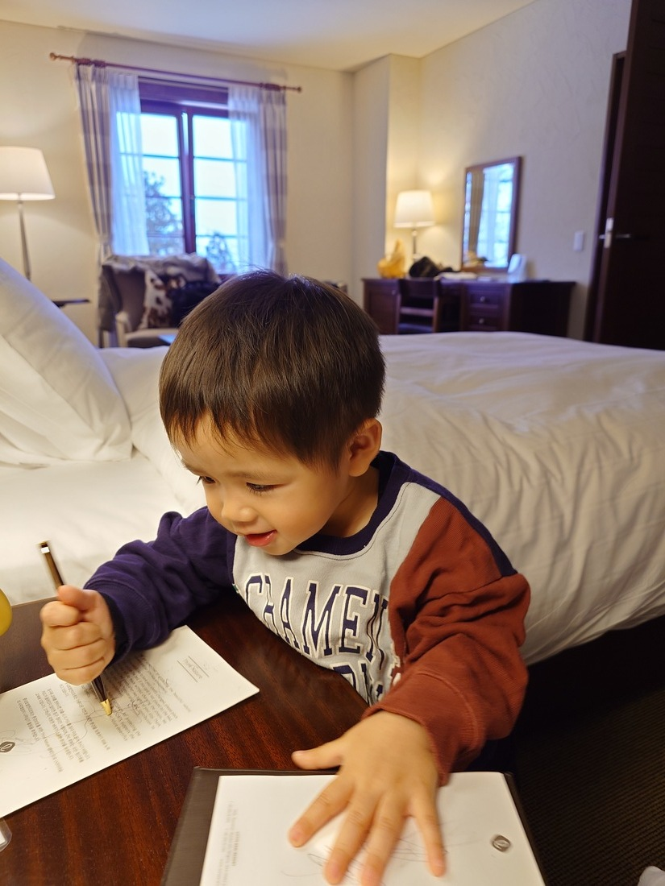

接續上一篇文，這次到日本的最大目的就是要去滑雪！

這次跟著姊夫公司的旅行團，和一家人同行加上姊夫公司即其他同事親友團共約一百人，陣容浩大的前往位於長野縣的樂天新井渡假村。

這次入住樂天集團的飯店，等級很不錯，室內空間超級大，估計有十五坪以上，兒子一到房間已經壓抑不住興奮的心情，到處亂跑亂玩，整個很不受控制哈哈。

後來隔天一大早，就將兒子交給爸媽協助照顧，這裡真的很感謝有他們的幫忙，讓我們夫妻有機會可以放下小孩去自由滑雪。

我們兩個都是初學者，這次跟的旅行團不只包了雪票，還有帶一位教練上團體課
