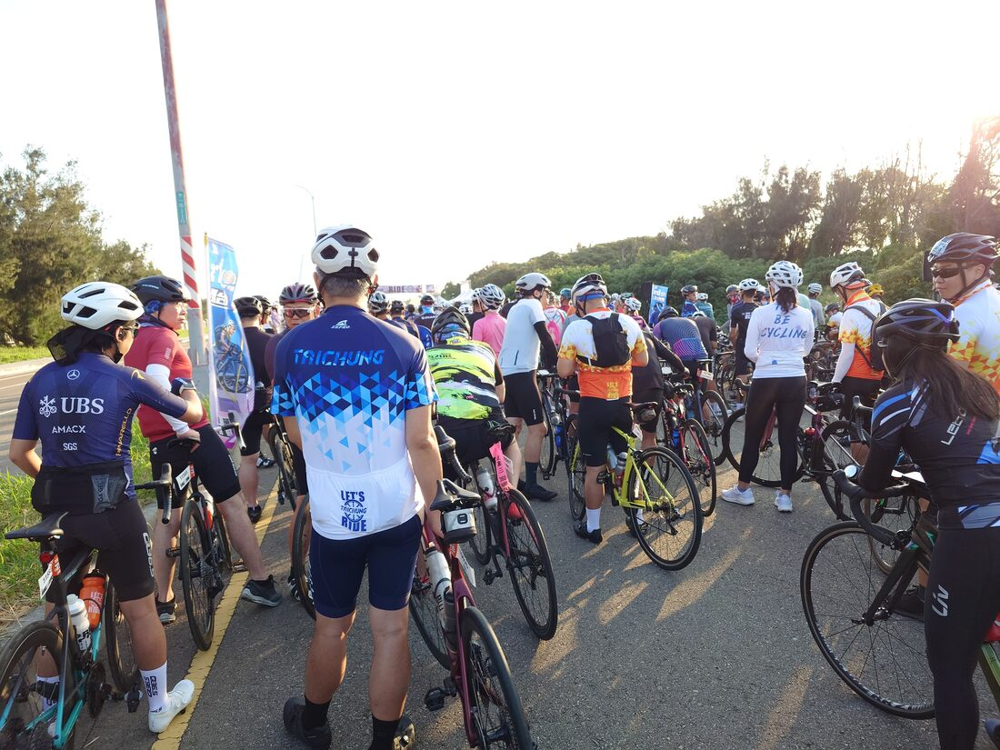
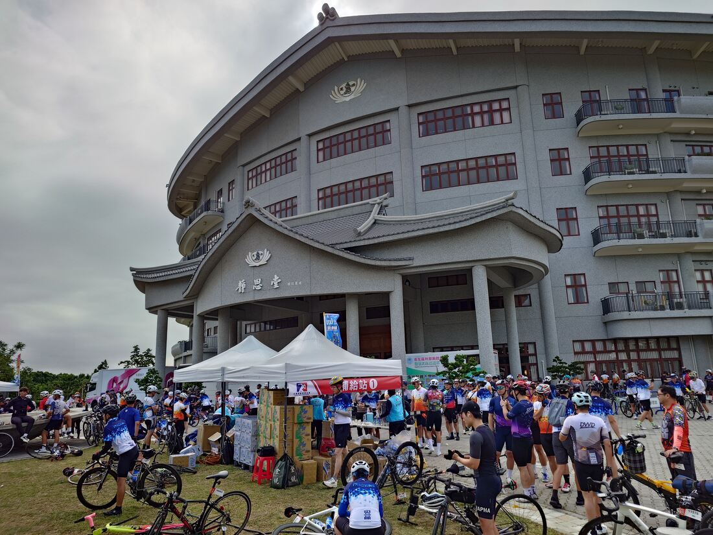
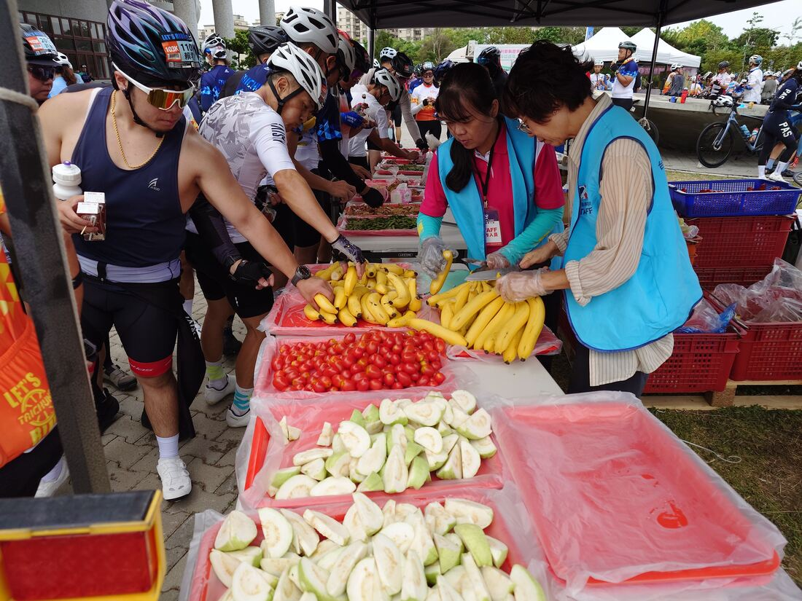
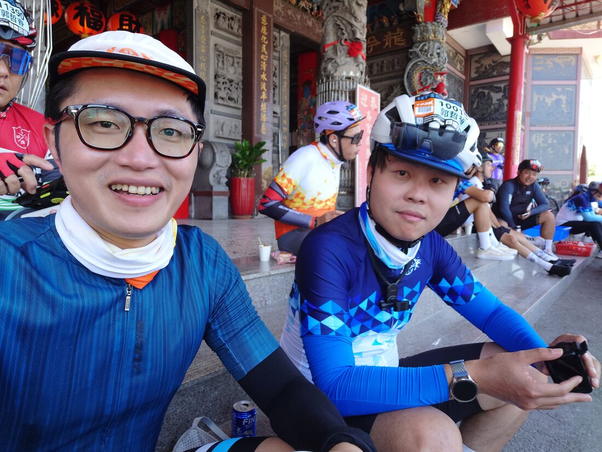
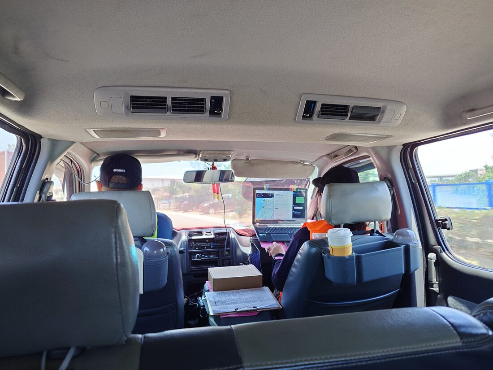
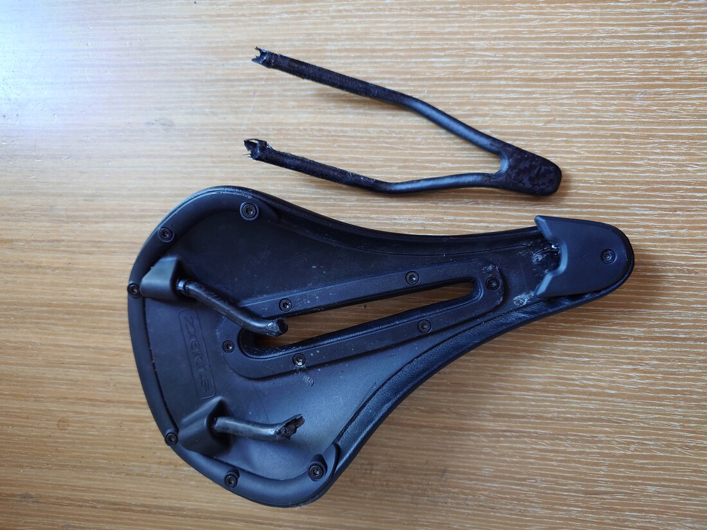

### 事前準備

今年五月底，和朋友參加了由全統公司主辦的「輪轉台灣百K單車挑戰賽」，活動分為45或103公里兩個組別，我和好朋友覺得自己體能沒問題就參加了103公里組！覺得自己真是勇敢😄。

平時和好友在假日偶爾會揪團騎個車，我在大學時期也有環島的經驗，但很久沒有騎車超過100公里，而且是在端午節前夕的超炎熱天氣，出發前也有點擔心自己曬傷或中暑之類的，防曬裝備及個人體能都是需要提前準備一下。

在出發前一日，剛好遇到兒子突然有點小感冒，原本想說還是乾脆退賽在家照顧兒子不要去了，但感謝老婆的體諒協助，願意讓我花一個白天的時間去騎腳踏車，老婆辛苦了！

### 出發當日
前一天弄小孩到到晚上十點，但心情有點緊張沒有睡好，當日一早四點半就起床，滿滿的疲勞感，和第一次參加台北馬拉松的感覺一樣。

表定是6點大會鳴槍，我大概五點半和朋友約集合，一起慢慢喇賽一路到出發點，發現已經有滿滿的人群在前面了，導致出發後有點塞車，以後要更早一點到比較好。

從高美濕地出發，一路沿著港口的路線走，雖然人車眾多，但大家的車速都很快不至於塞車，有些人以一群車隊集團前進，年齡層廣泛，有看到學生車隊及銀髮族車隊，大家的車速都很不慢，實在蠻佩服的。

騎過台一線沿海路段後，轉進龍井大肚開啟了爬山路線，這時整體車速就慢下許多，這時我們總算是開始慢慢超車其他人了。

在離起跑點25公里處有一個休息點—佛教慈濟慈善事業基金會東大園區。

超多補給品可以吃，就短暫休息一下，上個廁所，參加自行車活動比馬拉松活動感覺輕鬆多了~

後來爬完一波山，進入清水市區，又再度一個緩坡，此時里程已經累積60幾公里了，腳也開始有點酸，好在又有一些補給點可以休息，全統是舉辦自行車活動的老團隊，對整個活動規畫都很完善，附上一張在清水休息點的合照。

但在這個休息點準備離開後，我們發現腳踏車的數量越來越少，感覺我們應該是整體參賽者的後半段，原本一開始出發能保持時速30幾，還以為自己腳力還不錯，但時間久了就越來越發現大家好像都休息一下就出發了，我們算是整個慢慢來，導致整體在群體排名是越來越往後。

### 突發意外

在最後離終點20幾公里處，大約位在大安鄉的農田，突然腳踏車「碰！」的一聲大響，我的後輪因為碰到尖銳物瞬間爆胎扁掉，事發突然，一時還不知道怎麼辦，自己又忘記攜帶內胎和CO2鋼瓶，只能使用大會的通報系統請維修車隊前來更換內胎，但因為我的外胎破裂程度嚴重，只能使用紙片做為替代修補一下，爆胎之後，我發現我的坐墊也變得有點歪歪斜斜的...，為後續的路程帶來一層隱憂。

換完內胎以後，繼續出發5~6公里，不出意外的話就要出意外😅，又發生一次爆胎，外胎已經不堪使用，導致任何一點小碎石都會再次引發爆胎，同時發現坐墊已經完全不堪使用，整個坐弓也已經完全斷裂，只能忍痛宣布棄賽了。

在最後離終點約十公里處被保母車載走，實在好可惜啊！

後來只能讓朋友自己獨自騎回終點，不耽誤時間，讓他先去完賽吧！

### 參賽心得

首次參加自行車活動，雖然沒有順利抵達終點，但這個過程仍是非常有趣的。
回到家中，看到坐墊整個裂開，真想不到會損傷這麼大...，建議大家如果要買碳纖維坐弓的坐墊，務必要確認清楚鎖的位置，如果鎖得太偏某一側，容易發生應力集中導致整個斷裂。

也透過這次參賽，我才知道真是大家的參賽水準都很高，速度也都很快（高級車也好多），以後真的要多練一下自己的自行車能力，未來參賽要更進步！